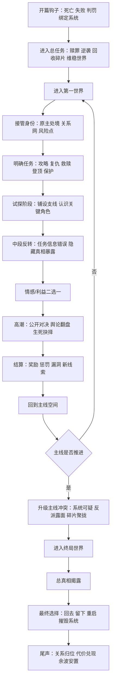

# 快穿文研究与写作实务报告

## 执行摘要

快穿文可以概括为一种“多世界、任务驱动、单元推进、主线回收”的网络小说亚类型：主角在短时间内穿行多个世界，通过系统、契约、执念或惩罚机制完成任务，并在每个小世界里用不同身份触发新的情感与冲突。它的流行与移动阅读、碎片化阅读、女频空间叙事扩张以及“系统化爽点生产”密切相关；公开可见资料显示，到2024年底，中国网络文学用户已达5.75亿，阅读市场规模430.6亿元，快穿虽属细分类型，却在晋江、起点女生、哔哩哔哩、豆瓣等平台持续有高热作品、教程与推文流通。对写作者而言，快穿最大的优势是模块化：一个世界失手，不等于整本书失控；最大的风险则是世界同质化、系统工具化、主线空心化。写好快穿的关键，不是“世界多”，而是“每一世界都推动主角核心问题向终局逼近”。 citeturn14search1turn15search0turn15search2turn12search7turn29search5

## 定义与类型

从可检索的中文资料看，“快穿”作为网络文学明确可识别的分类，最迟在2014年前后已进入网文社区公共讨论；2019年媒体将其称为“新兴文学类型”，2020年的硕士论文则进一步总结其叙事特征为“反类型”尝试与“二倍速”推进。换句话说，快穿并不是凭空诞生的新物种，而是由“穿越叙事”“系统机制”“任务闯关”和“多空间切换”几股潮流叠加而成的成熟亚类型。 citeturn14search3turn14search1turn14search8turn15search0

快穿文的核心要素，通常由四层构成。第一层是**跨世界机制**，即主角为什么能不断进入新世界；第二层是**任务机制**，即每一世界必须完成什么；第三层是**单元机制**，即每个世界都要有独立起承转合；第四层是**总主线机制**，即所有世界完成后，主角要面对的终极真相、终极关系或终极选择。缺一不可。只有“穿”而没有“任务”，容易沦为散装穿越；只有“任务”而没有“主线”，则容易变成重复刷本。 citeturn14search3turn15search0turn14search8

常见子类型可以按“读者爽点”而不是按世界题材来划分。最常见的有：攻略型、打脸型、救赎型、逆袭型、事业型、治愈型、修罗场型、无CP成长型，以及“男主切片回收型”。从晋江公开可见的头部作品标签看，快穿最容易与“女配”“打脸”“系统”“甜文”“轻松”“爽文”“单元文”“穿书”等词共现；从纯爱路线看，系统、快穿、升级流、甜文、单元文同样高度常见。 citeturn27search0turn27search1turn27search2turn28search1turn28search2

与相近类型相比，快穿最重要的区别不是“会不会换地图”，而是“叙事重心到底放在哪里”。

| 类型 | 核心驱动 | 主角身份 | 典型篇幅感 | 写作重点 |
|---|---|---|---|---|
| 快穿 | 任务完成 + 角色扮演 + 主线回收 | 常常需要接管他人身份、完成命运修正 | 单元清晰，节奏偏快 | 单元爽点、切换效率、主线串联 |
| 无限流 | 生存规则 + 团队协作 + 副本求生 | 通常仍是“原本的我”进入副本 | 副本较长，规则更重 | 规则设计、群像关系、危险感 |
| 系统文 | 系统只是装置，可能单世界也可能多世界 | 不限定 | 可长可短 | 奖惩逻辑、升级反馈 |
| 单次穿越/穿书 | 重点在单一世界的蝴蝶效应 | 多是一穿到底 | 世界沉浸更强 | 时空差、身份安置、单世界深挖 |

关于“快穿 vs 无限流”，中国作家网的分析指出，快穿通常聚焦单主体，而无限流更倾向群像与团队；晋江论坛的创作讨论也常把“快穿是扮演别人、过别人的人生”与“无限流仍然是你自己进入副本”区分开来。至于“系统文”，更像是一种装置或技术手段，而不必然等于快穿。 citeturn31search7turn31search10

**来自用户视频**：由于哔哩哔哩页面抓取受限，本文无法获取该视频的完整字幕，只能依据可检索到的视频标题与简介元数据使用其观点。该视频明确强调了五个问题：快穿写作签约技巧、快穿与无限流/系统文的区别、为什么新手适合写快穿、如何手把手搭建快穿文、以及“快穿文三大禁忌与投稿平台”。同时，相关检索结果显示，同一UP主的快穿写作教程视频公开播放量约在2.3万至4.3万区间，说明“快穿写作方法论”本身已有稳定受众。 citeturn9search0turn22search13turn21search4turn21search10

## 读者与市场

从整体行业看，快穿不是“大盘类型”，但它依附于一个足够大的网文消费生态。公开报告显示，截至2024年底，中国网络文学用户规模约5.75亿，阅读市场规模约430.6亿元，作品总量约4165.1万部，IP改编市场规模约2985.6亿元。也就是说，快穿得以长期存活，不靠单一平台红利，而是依靠整个网络文学市场的庞大基座。 citeturn12search1turn12search7turn12search10

用户画像方面，用户未指定目标年龄层，本文依照你的要求，实务上默认面向**18—35岁通俗网文读者**；但若把视野放宽到整个网文市场，2025年公开报道显示，网络文学核心阅读群体已扩展到26—45岁约占一半，“00后”约占近四分之一，45岁以上读者比重也在上升，说明“快穿只给非常年轻的读者看”并不成立。与此同时，北京大学发布的番茄读者偏好调研显示，18—24岁读者尤其偏好“系统”“天才”等想象机制；“甜宠”呈明显年轻化趋势；女性读者在人设上偏好“女强、团宠、公主”等身份想象。把这些偏好叠加起来，正好能解释为什么快穿文常常与“系统 + 甜宠/爽感 + 强设定人设”绑定。 citeturn12search8turn26view0

晋江是观察快穿女频市场最直接的窗口。晋江官方“关于我们”页面显示，平台拥有在线网络小说超710万部、版权作品逾98万部，是中国大陆具有较高影响力的女性向原创文学网站之一；而在公开可见的快穿作品库中，《我有美颜盛世[快穿]》作品积分约22.47亿，《快穿失败以后》约20.39亿，《每个世界苏一遍》约36.79亿，说明“快穿 + 女配/系统/轻松/爱情”是能做出长期高热头部作品的。对写作者来说，晋江快穿市场的关键词不是“世界观宏大”，而是“人设吸力 + 感情节奏 + 单元爽点”。 citeturn29search5turn27search0turn27search1turn27search2turn27search7

纯爱快穿同样不是边角料。晋江公开页面显示，《当巅峰遇到巅疯[快穿]》作品积分约22.38亿，标签组合为“打脸、系统、快穿、升级流、轻松”；2026年连载中的《成为渣攻的顶头上司[快穿]》作品积分也已超过22亿，标签则是“系统、甜文、快穿、穿书、爽文、单元文”。这说明快穿在纯爱市场里也能容纳两条高热路线：一条是沙雕升级流，一条是甜爽单元流。 citeturn28search2turn28search1

起点女生网则更能观察“快穿的长连载化”。起点女生网官方定位是女性原创网络文学门户，公开页面中“快穿”搜索与“科幻空间”分类持续存在；可见作品如《快穿之我只想死》已更新至543章，《快穿之今天有好戏看么》已更新至567章，《快穿之白眼狼你好》也已完结至357章。换言之，若你走的是无CP、事业升级、反派清算、长期任务链这一路，起点女生的“科幻空间/快穿”更容纳长篇刷本式连载。 citeturn18search0turn18search3turn18search19turn18search7turn18search9turn18search24

在传播链上，哔哩哔哩与豆瓣分别承担两种功能。B站更像“快穿的二级传播器”：快穿写作教程视频公开播放量可达2.3万—4.3万，推文视频常见7万—23万播放，个别高热快穿合集甚至可达60万级。说明快穿不仅被“看”，还被“讲”“被安利”“被拆解”。豆瓣则更像“长尾口碑库”：可检索的“快穿文小组”成员约3069人，近年仍持续出现求文、找文、推荐旧作、比较不同路线的讨论，常见关键词包括“女配逆袭”“妖艳贱货风格”“无CP快穿”“JJ和PO的快穿对照”等。B站适合做认知入口，豆瓣适合验证长期复读价值。 citeturn21search2turn21search6turn21search14turn22search13turn23search0turn23search7

微博的数据对“快穿”这个细分词并不稳定公开，但微博官方帮助明确说明：话题阅读数是各端带话题微博被看到次数的累计，而非独立人数。对作者而言，这意味着微博更适合做**#书名# + #快穿# + 角色名/世界名**的持续曝光，而不适合用缺乏稳定可核验数据的“单次爆量”判断市场热度。关于“快穿”本身的可靠公开总阅读量，本文未获得足够稳健的数据，因此标注为**未公开/无可得稳定数据**。 citeturn24search0turn24search3

可以把主要平台理解为下表：

| 平台 | 对快穿最重要的价值 | 公开可见信号 | 适合什么写法 |
|---|---|---|---|
| 晋江 | 女频恋爱与人物关系市场 | 头部快穿作品积分20亿—36亿级 | 感情线强、女配打脸、切片男主、甜虐兼容 |
| 起点女生 | 长连载、无CP、科幻空间容纳度 | 多部快穿长篇达300—500章以上 | 事业流、系统流、长期刷本、养老/逆袭链 |
| B站 | 教程与推文传播 | 写作教程2.3万—4.3万，推文7万—60万级 | 做认知、吸引新读者、验证题材热词 |
| 微博 | 话题曝光与角色二创 | 话题阅读按展示累计，快穿细分总量缺稳定公开值 | 连载宣发、角色话题、更新提醒 |
| 豆瓣 | 口碑沉淀与老文回流 | 快穿文小组持续活跃 | 核验复读率、辨认经典套路是否过时 |

## 结构节奏与任务循环

快穿文的最大写作优势，是它天然带有“循环结构”。每一个世界都像一个微型剧：开场接身份，中段立目标，后段翻局面，尾声结任务；但所有世界又必须一起服务一个更大的总问题。学术研究把快穿概括为“二倍速”叙事，媒体则指出它常见于三四十万字的中短篇体量；这两点结合起来，意味着快穿最怕的不是信息量不够，而是节奏失焦。你必须几乎每一章都让读者知道：**主角这次要做什么、现在卡在哪里、下一步会引爆什么**。 citeturn15search0turn14search1

下面是一条可直接套用的“典型任务循环”：

在实操层面，如果你是第一次写快穿，比较稳妥的建议是：**全书控制在25万—45万字，设置6—8个世界，单个世界2.5万—5万字，主线空间与终局合计占全书15%—20%**。这一体量最接近“快穿的阅读期待”：够爽、够换景、不会拖烂。若你要走起点女生式长编刷本路线，则可以拉长到80万字以上，但必须把主线从“恋爱回收”升级成“事业/秩序/世界机制”层级，否则很难支撑长跑。这个建议与快穿常见中短篇体量，以及起点可见的数百章快穿长连载案例相一致。 citeturn14search1turn18search7turn18search9turn18search24

章节的节奏，不建议平均主义。更推荐“短起、快推、慢炸、快收”的四拍法：  
开章用150—300字给出异样；前半章迅速抛出任务和敌我关系；中段把冲突压住，用人物互动与误导制造期待；章末再抬一次钩子。手机阅读环境下，单章2000—3500字最稳，情绪高潮章可扩到4000字以上，但不要持续大章，否则“快穿”的机动感会被磨钝。这个建议是写作层面的经验值，而非平台硬规则。 citeturn15search0turn14search1

高潮写法上，快穿特别适合“三重高潮叠加”：  
第一重是**任务高潮**，也就是读者想知道“这次任务到底成不成”；  
第二重是**情感高潮**，也就是主角会不会因角色关系而改变初衷；  
第三重是**主线高潮**，也就是这一世界暴露了总谜团的哪一片。  
最强的一类快穿高潮，往往不是“任务完成”本身，而是“任务完成的方式，反过来刺穿了主角的核心命题”。比如主角本来只想冷静刷本，却第一次主动为某人违规；又比如她看似完成攻略，实际上第一次拒绝系统最优解。这样高潮才不只是再刷一遍流程。 citeturn15search0turn15search2

收尾则有四种常见有效法。其一，**回环式**：以第一世界的意象、誓言、道具在最终章回收；其二，**代价式**：完成全部任务，却失去记忆、身份或回归机会；其三，**真相式**：所有世界其实围绕同一人、同一错误或同一次失败展开；其四，**开放式余波**：主线完结，但保留一两个世界的后续想象空间。快穿尾声最忌“主线突然解释完、感情突然在一起、系统突然自爆”，因为这会让前面所有世界只剩下过站感。好的尾声，应该让读者觉得：原来每一站都不是白走。 citeturn15search0turn27search1

## 人设设定与情节库

快穿文的人设，其实不是“固定性格”，而是“固定核心问题在不同世界的不同显影”。也就是说，你可以让主角在校园世界表现得机灵，在权谋世界表现得深稳，在娱乐圈世界表现得会演，但她内里那个最根本的问题必须是同一个：比如不信任亲密关系、过度追求控制、无法接受失败、极端渴望被看见。这样，换世界才叫“成长弧的不同切面”，而不是“换皮”。北京大学的读者偏好研究显示，系统、甜宠、女强、团宠、公主型人设在年轻读者中具有明显吸引力；晋江头部快穿作品的公开标签也显示，“女配、打脸、轻松、爽文、系统、单元文”与高热快穿高度共现。下面的人设模板，可以直接拿来搭骨架。 citeturn26view0turn27search0turn27search2turn28search1turn28search2

| 模板 | 性格 | 核心动机 | 内部冲突 | 常用台词或行为 |
|---|---|---|---|---|
| 冷静任务者 | 理性、节制、观察力强 | 完成任务、尽快回归 | 越理性越容易失去真实情感 | “先别急，让我把规则看完。” |
| 黑莲花反击者 | 外柔内狠、善谋后手 | 雪耻、夺回主体权 | 害怕再次被当成工具 | 表面退让，转身布三层局 |
| 戏精钓系主角 | 会演、会示弱、善操控场面 | 让目标自己上钩 | 演久了怕没人认得真我 | “你误会了，我从来没说过我无害。” |
| 事业脑逆袭者 | 高执行力、低恋爱脑 | 登顶、出名、翻盘 | 为效率牺牲关系 | 熬夜做计划表，对人心也列表格 |
| 温柔修复者 | 共情强、边界感弱 | 救人、修复残局 | 容易把拯救当成自我价值 | 会记住每个人不被看见的小习惯 |
| 嘴硬心软型 | 毒舌、别扭、行动大于表达 | 自保 | 真正动心时会失控 | 一边嫌麻烦，一边替人挡刀 |
| 疯批边缘人 | 偏执、攻击性强、魅力危险 | 不再被抛弃 | 把占有误认成爱 | 盯人太久，笑意先于威胁出现 |
| 社恐观察者 | 安静、敏感、记忆细碎 | 想安全地活下去 | 渴望连接又惧怕暴露 | 少说话，多记细节，关键时一击必中 |
| 失忆型强者 | 本能强、身份存疑 | 找回真相 | 越接近真相越怕自己不可爱 | 对某些意象有条件反射 |
| 母性/养成型主角 | 稳、暖、能托底 | 保住某人或某群人 | 把照顾别人当成逃避自我 | 先安排饭和住处，再谈复仇 |

配角也不该只是世界功能件。快穿里最常用、也最容易写废的配角有四类：一是**当前世界目标人物**，二是**世界反派/竞争者**，三是**系统/助手**，四是**与主线真相相关的重复出现者**。其中最值得经营的是第四类，因为它承担“世界之间的连通感”。如果你想让读者更早感明白“这些世界是同一部书”，就让某句口头禅、某枚戒指、某种伤痕、某类目光，在不同世界反复出现。这样哪怕读者还没看见答案，也会先感到命运的回声。 citeturn27search1turn28search1

快穿的世界与套路，最好理解为“情绪用途库”。你不是为了凑二十个地图才去写二十个世界，而是为了高密度输出不同情绪价值：甜、虐、燃、爽、疼、修罗场、事业压迫、命运回响。以下二十类，是基于晋江快穿作品库、系统榜、起点快穿搜索结果、哔哩哔哩推文高频话题与豆瓣讨论热词综合归纳出的“高复用世界库”。表中每行给出三个可直接开写的钩子。 citeturn27search7turn16search0turn18search3turn21search2turn23search0

| 世界/套路 | 核心爽点 | 钩子一 | 钩子二 | 钩子三 |
|---|---|---|---|---|
| 校园逆袭 | 青春、打脸、初恋拉扯 | 开局即被全校偷拍视频造谣 | 学霸男主发现主角在装差生 | 原主日记暴露“真正受害者” |
| 娱乐圈黑红 | 舆论翻盘、马甲反击 | 开场就在塌房直播间 | 黑粉头子竟是前任务目标碎片 | 综艺录制中身份被迫暴露 |
| 豪门白月光 | 替身、上位、修罗场 | 婚礼当天被换掉新娘 | 男主的“白月光”其实是主角前世 | 遗嘱公开，继承条件是先离婚 |
| 真假千金 | 身份夺回、家庭权力 | 回家第一天就被认成保姆女儿 | 真千金知道一切却故意不认亲 | 全家体检报告揭穿血缘链 |
| 后宫争宠 | 宫斗、权谋、情欲 | 冷宫开局，手里只有一张旧画像 | 皇帝把她当替身，她把皇帝当跳板 | 宫宴刺杀让她提前暴露锋芒 |
| 夺嫡权谋 | 站队、谋局、登位 | 她刚穿来就成了弃子侧妃 | 太子与反王都想拉她入局 | 旧案卷宗里有她原主亲笔 |
| 侯门宅斗 | 家族控制、隐忍反杀 | 婆母逼她签下休书 | 失踪多年的嫡姐突然归来 | 祠堂火灾烧出真正身世 |
| 民国谍战 | 双面身份、危险暧昧 | 她是歌女，也是密码运输人 | 目标对象白天是少帅，夜里是审讯者 | 一封旧情书其实是情报地图 |
| 仙侠师徒 | 禁忌关系、飞升代价 | 她是即将被祭阵的小师妹 | 高冷师尊每晚梦到她另一世 | 成仙条件是亲手杀掉她 |
| 修真升级 | 打怪、资源争夺、登峰 | 废灵根开局，宗门大比在即 | 系统给错功法却误打误撞成人外法器 | 她救下的路人竟是未来天道 |
| 西幻学院 | 魔法、阵营对立、成长 | 她是最差班的新生 | 圣子把她当异端，魔王把她当同类 | 入学测试测出“已死亡灵魂” |
| 星际联姻 | 身份错位、文明差异 | 婚约对象是敌国指挥官 | 她被判定为低匹配，却能安抚全舰暴走 | 虫洞里捞出的黑匣子写着她名字 |
| 末世求生 | 生存、资源、人性 | 她醒来时车队正投票赶她走 | 治愈系异能被当成诱饵 | 安全基地的救世主是伪神 |
| 赛博都市 | 真假记忆、资本压迫 | 她接到“删除自己”的订单 | 目标人物是一段被复制的意识 | 反派公司在贩卖人的痛感数据 |
| 电竞直播 | 热搜、逆袭、同频暧昧 | 她是被全网骂的代打嫌疑人 | 队长现实里认出她是儿时玩伴 | 决赛夜设备被黑，必须裸打翻盘 |
| 职场律政 | 智斗、现实压迫、关系升级 | 她替上司背锅被全组孤立 | 对手律师正是前世界恋人切片 | 案件卷宗里藏着她原主死亡真因 |
| 养崽治愈 | 治愈、情感补偿、成长 | 她接手的是“未来会毁灭世界”的孩子 | 系统要求冷处理，她偏要真养 | 孩子画的每一张画都预示灾难 |
| 兽世/异种 | 陌生文明、身体张力 | 她被当成祭品送进禁地 | 异种首领嗅觉能认出她穿越气息 | 部落公选要她在三名配偶中做选择 |
| 中年重启 | 现实爽感、人生回档 | 她穿成被离婚的四十岁女人 | 女儿恨她，前夫想复婚，老板想利用她 | 她重启事业时发现原主藏了巨债 |
| 老年逆袭/养老局 | 反常规、情感厚度 | 主角开局就是退休老人 | 系统要她“谈恋爱”，她只想活得体面 | 她的老伴其实在更高维等她通关 |

如果你担心世界太多写散，最稳的办法不是删世界，而是把二十个世界压缩到三种功能层：**给糖的世界、给刀的世界、给答案的世界**。甜宠、养崽、校园、电竞适合给糖；后宫、谍战、末世、真假千金适合给刀；仙侠、赛博、星际、修真适合给答案。你只要记住每个世界属于哪个功能层，就不容易写成“一路都在同一种情绪里打转”。 citeturn21search2turn23search7turn27search1

## 写作技法与大纲模板

快穿文的语言，第一原则不是华丽，而是**清楚地推进情绪**。因为世界切换太快，读者没有耐心在一个新世界里重新适应半天。对白要担三项工作：立角色、推关系、埋反差；内心独白要担两项工作：校正读者视线、暴露主角真正代价；转场要做的事则只有一件——确保读者知道“现在进入了一个新秩序”。如果一个世界开头三章还没把身份、任务、危险、目标人物讲明白，多半已经输掉半程。这个要求与快穿“二倍速”“篇幅短、节奏快”的文体特性高度一致。 citeturn15search0turn14search1

下面这张表，适合当成你的写作技法速查表：

| 技法 | 适合快穿的写法 | 不建议的写法 |
|---|---|---|
| 对白 | 让每句对白都带立场差：试探、误导、拉扯、逼问 | 纯解释设定、直给世界观说明 |
| 内心独白 | 只写“她不肯承认但已经动摇”的部分 | 把剧情再复述一遍 |
| 节奏词句 | 多用动作切句：“她顿住”“门开了”“他没回头” | 大段形容词堆叠，压慢移动感 |
| 转场 | 以道具、伤口、梦境、结算界面衔接 | 机械写“于是她去了下一个世界” |
| 伏笔 | 提前埋能跨世界回收的意象与习惯 | 只埋本世界一次性答案 |
| 反转 | 让信息差与情感差同时翻转 | 只靠“其实他很有钱/有身份” |
| 爽点 | 打脸要有公开见证，甜点要有关系推进 | 私下小摩擦，读者感受不到回报 |
| 虐点 | 让读者知道主角为什么必须失去 | 纯误会、纯拖延、不讲代价 |

对白最有效的模型，是“表层意思”和“真正意思”不同。比如男主说“随你”，表层是放手，真正意思可能是试探；主角说“任务而已”，表层是无情，真正意思可能是先护住自己。这种双层对白最适合快穿，因为读者会天然期待：这一层戏，是为了当前世界，还是为了总主线？只要你让两层都成立，人物就不会扁。 citeturn27search1turn28search2

伏笔与反转的写法，建议你只抓两种。第一种是**信息伏笔**：某条规则、某个名字、某个重复意象，读者先记住但暂时不懂。第二种是**情感伏笔**：某人对她天然熟悉、厌恶、心软、恐惧，读者先感到不对。快穿最强的反转，往往不是“世界设定反转”，而是“关系性质反转”：你以为这是攻略对象，其实是上一世债主；你以为系统在帮她，其实在筛查她；你以为每个世界男主都不同，其实只是同一灵魂的不同切片。 citeturn27search1turn28search1

常见问题与对应修改，建议你对照下表逐项自检：

| 常见问题 | 症状 | 修改办法 |
|---|---|---|
| 世界同质化 | 换了朝代没换冲突结构 | 先定“这个世界提供什么独特代价” |
| 系统太像播报器 | 只会发任务、结算分 | 给系统立欲望、立偏见、立隐瞒 |
| 主角没有成长 | 每个世界都稳赢、没代价 | 让她每赢一次，都付出一个不可逆选择 |
| 感情线飘 | 每个世界都像速食恋爱 | 规定每个世界只推进同一关系的一小步 |
| 爽点不够响 | 打脸都在私底下完成 | 关键翻盘要让公众、家族、宗门、直播间“看到” |
| 收尾发虚 | 最后一世界只是解释会 | 把最终决战设计成价值观选择，而不是说明会 |
| 配角像NPC | 工具完即下线，没有余味 | 给至少一个配角“让读者会想起他”的动作或缺点 |

如果要开一本可复制的快穿文，下面这个总纲模板最实用：

| 模块 | 建议字数 | 核心目标 | 章末钩子示例 |
|---|---:|---|---|
| 开篇绑定 | 0.8万—1.2万 | 抛出生死/失败/判罚，建立总任务 | “系统第一次没有回应她。” |
| 世界一 | 2.5万—4万 | 立规则，证明主角可看 | “他看她的眼神，像看一个死而复生的人。” |
| 世界二 | 3万—4.5万 | 扩大爽点，埋第一层主线异样 | “结算界面上，多出一行本不该存在的名字。” |
| 世界三 | 3万—5万 | 让主角第一次失控或违规 | “她明明已经完成任务，却没有立刻离开。” |
| 世界四 | 3万—5万 | 情感线显著推进 | “他叫出了她从未在这个世界说过的名字。” |
| 世界五 | 3万—5万 | 主线真相开始聚拢 | “系统说谎了，这不是第一次任务。” |
| 世界六 | 3万—5万 | 让主角必须在任务与所爱之间选 | “只要她按下确认，他会像前几个世界一样消失。” |
| 终局世界 | 4万—6万 | 揭真相、打总BOSS、做核心选择 | “原来她一直在通关的，是自己的那次失败。” |
| 尾声 | 0.8万—1.5万 | 安放余波、回收意象 | “这一次，再没有结算音响起。” |

单章模板也可以直接套：

| 单章位置 | 本章目标 | 建议字数 | 开头句型 | 结尾句型 |
|---|---|---:|---|---|
| 开章 | 抛新麻烦 | 1800—2500 | “她一睁眼，正好听见……” | “比这更糟的是——” |
| 推进章 | 增加关系和信息差 | 2200—3200 | “她原本只想……” | “他显然知道了什么。” |
| 反转章 | 把前文判断掀翻 | 2500—3800 | “事情从这里开始不对。” | “任务栏第一次变成了红色。” |
| 高潮章 | 公开奖惩与选择 | 3000—4500 | “所有人都在场。” | “她按下确认，却没有离开。” |
| 回收章 | 结算与余震 | 1800—2600 | “安静下来以后……” | “新的传送门已经打开。” |

下面给你三个可以直接改名字开写的示例大纲。

**甜宠型示例**  
一句话梗概：高冷女任务者绑定“恋爱矫正系统”，每个世界都要修复一段本应破裂的关系，却发现所有目标人物都带着同一个人的性格切片。  
世界序列：校园误会 → 娱乐圈假情侣 → 星际联姻 → 仙侠双修禁令 → 终局现实。  
主线推进：前两个世界让她明白“他总会先认出她”；第三世界让她第一次为对方违规；第四世界揭示系统是用她的情感数据在训练切片人格；终局她选择摧毁系统，但保留切片的成长结果。  
适合标签：快穿 / 甜文 / 系统 / 轻松 / 单元文 / 男主切片。  
卖点句：**“她以为自己在修别人的爱情，后来才知道，他一世又一世在学着爱她。”**

**虐恋型示例**  
一句话梗概：女主为了复活弟弟，被迫穿进一系列“她必须离开才算任务完成”的世界，每次刚被爱上就必须亲手抽身。  
世界序列：民国歌女与少帅 → 宫廷替身妃 → 末世搭档 → 修真师徒 → 终局审判空间。  
主线推进：每个世界都让她赢任务、输关系；第四世界暴露弟弟早已死亡，系统真正目标是收集“被迫诀别”的极端情绪；终局她拒绝复活幻觉，转而释放所有被系统反复压榨的任务者。  
适合标签：快穿 / 虐恋 / 系统 / BE过程HE结局 / 情感拉扯。  
卖点句：**“她不是不爱，只是每一次，爱都恰好是她必须放手的证据。”**

**权谋型示例**  
一句话梗概：曾经失败过一次的女谋士，被送回多个平行权力世界修正关键政治节点，最终要决定的是“辅佐谁”，还是“成为秩序本身”。  
世界序列：侯门宅斗 → 夺嫡王朝 → 民国议会 → 星舰联邦 → 终局废墟王座。  
主线推进：前两世修正的是家国秩序；第三世界让她意识到每一世都有人在操盘她的站队；第四世界发现系统背后是“最优统治模拟”；终局她拒绝当任何人的谋臣，而是公布全部真相，让旧秩序自行崩塌。  
适合标签：快穿 / 权谋 / 女强 / 事业流 / 反系统。  
卖点句：**“她曾经替别人夺天下，这一次，她先问这天下值不值得被夺。”**

## 投稿版权与参考资源

先说平台实务。晋江官方帮助信息显示，作者注册后即可直接发表作品，无需预审；如果单篇作品满一万字且文章属性等信息填写完整，可以在网页端通过“我的晋江—写作—我要签约”申请签约，签约年限有5年、10年、15年、20年等选项；而作品达到3万字以上并具有一定人气基础后，签约作者可以申请作品进入VIP。更进一步，晋江“驻站作者”有额外门槛，如全版权独家授权、剩余合同年限不少于5年、作者星级达到要求且无处罚记录等。对新作者而言，这几条意味着：**先发文试水是低门槛，但签约、VIP、驻站是逐级抬门槛的。** citeturn10search1turn11search5turn11search19turn11search3

关于合同，必须把“签约”与“合同审读”分开理解。按照《著作权法》与实施条例，许可使用合同至少应明确权利种类、专有或非专有、地域范围与期间、付酬标准和办法、违约责任等核心条款；专有使用权通常应采取书面形式。这意味着，无论你签的是哪一家的网络文学合同，审读时都必须逐条核对以下问题：  
你授权的是电子连载权，还是包含改编、出版、音频、影视、动漫、游戏等更广权利；  
授权是独家还是非独家；  
期限是固定年限还是附带续展条件；  
收益分成按什么口径结算；  
平台是否有再授权权；  
违约责任和解约条件是否对等；  
作品下架后权利如何处理。  
这些是法律层面的“必看项”，不是多疑。以下信息整理仅作写作者参考，不构成法律意见。 citeturn30search3turn30search6turn30search8

结合晋江的帮助页与现有平台机制，签约后的实操流程还有两点常被忽略。第一，签约不是结束，后续还涉及收款账户协议、税务申报与作者后台设置；第二，平台推荐并不只看“签没签”，作品信息完整度、更新稳定性、标签清晰度、评论反馈与读者粘性都会影响可见度。晋江帮助中心已有关于收款账户协议、作者后台功能、VIP申请等分项说明。 citeturn11search7turn10search9turn11search11

**连载策略**上，如果你写的是恋爱型快穿，我建议采用“存稿起跑 + 稳定日更 + 三世界定生死”的思路。更直接地说：开文前最好准备至少前两个世界的细纲和前15—20章存稿；世界一负责让人愿意追，世界二负责证明你不是重复，世界三负责把主线真相钩出来。因为快穿的魅力不是“切世界”本身，而是“每次切世界都让人更想知道真相”。如果前三个世界还没形成“这个作者会收线”的信心，读者很容易中途弃文。这个建议与快穿模块化、读者追更对稳定回报的需要相匹配，也是从头部快穿作品明显重视标签清晰与世界区分中抽出的实务经验。 citeturn27search7turn28search1turn28search2

**完结策略**上，快穿特别适合“正文强收束，番外轻补偿”。正文一定优先解决三件事：主线真相、核心关系、系统代价；番外再负责补甜、补日常、补个别世界余波。不要把关键解释放进番外，也不要用十几个番外去弥补正文没收住。所谓“快穿后劲”，不是番外越多越好，而是正文一合上，读者还能立即回想起每个世界为什么存在。 citeturn27search1turn27search2

**标签与推荐优化**上，最稳的配置是“一个结构标签 + 两个情绪标签 + 一个钩子标签 + 一个风格标签”。例如：  
快穿 / 系统 / 甜文 / 女配逆袭 / 轻松  
快穿 / 打脸 / 修罗场 / 白月光 / 爽文  
快穿 / 权谋 / 女强 / 单元文 / 正剧  
快穿 / 无CP / 事业流 / 反派清算 / 升级流  
这样做的好处是：结构先帮读者识别赛道，情绪标签告诉读者主要回报，钩子标签说明梗点，风格标签降低试错成本。晋江头部快穿的公开标签已经反复说明，系统、快穿、打脸、甜文、轻松、爽文、单元文这类词的组合是高频且有效的；起点女生则更适合把“科幻空间、无CP、升级流”放到更前面。B站或微博宣发时，标题与话题也尽量与正文标签保持一致，别在文里写权谋救赎，外面却宣传成纯甜爽宠。 citeturn27search0turn27search2turn28search1turn28search2turn18search19turn24search0

最后列一份关键参考来源。以下不写裸链接，直接给出可点击来源标题：

| 来源 | 用途 |
|---|---|
| 用户视频《如何写好快穿文？快穿小说写作教程网文投稿签约攻略！合集！纯干货分享！》与相关同UP快穿教程检索结果 citeturn9search0turn22search13 | 提取“快穿/无限流/系统文区别”“新手适配”“禁忌与投稿”的视频视角 |
| 《2024中国网络文学发展研究报告》相关公开报道与新华社稿件 citeturn12search1turn12search7turn12search8turn12search10 | 行业规模、用户规模、读者年龄结构 |
| 北京大学《番茄小说免费模式读者偏好调研报告》 citeturn26view0 | 年龄、性别、情节与人设偏好 |
| 晋江文学城“关于我们”“帮助中心”与作品库/排行榜检索页 citeturn29search5turn10search1turn11search5turn11search19turn11search3turn27search7turn16search0 | 平台定位、签约流程、VIP门槛、快穿公开热度 |
| 晋江具体快穿作品页面与检索结果：《我有美颜盛世[快穿]》《快穿失败以后》《每个世界苏一遍》《当巅峰遇到巅疯[快穿]》《成为渣攻的顶头上司[快穿]》 citeturn27search0turn27search1turn27search2turn28search1turn28search2 | 分析高热标签组合与题材路线 |
| 起点女生网“快穿”搜索与“科幻空间”分类、相关长连载作品公开页 citeturn18search3turn18search19turn18search7turn18search9turn18search24 | 观察长篇/无CP/事业流快穿路线 |
| 中国作家网《无限流如何让我们欲罢不能？》及相关讨论页 citeturn31search7turn31search10 | 快穿与无限流的结构差异 |
| 青年报《“快穿小说”成为新兴文学类型》与CNKI硕士论文《网络快穿小说的叙事研究》 citeturn14search1turn14search8turn15search0 | 快穿的篇幅、节奏与叙事学概括 |
| 微博官方帮助：话题阅读数说明 citeturn24search0turn24search3 | 宣发时对“阅读量”的正确理解 |
| 豆瓣“快穿文小组”与推荐讨论页 citeturn23search0turn23search7 | 口碑长尾、老文回流与读者真实偏好线索 |

整体结论可以压成一句最实用的话：**快穿文不是“拼创意地图”的类型，而是“用多世界反复敲打一条核心命题”的类型。** 你只要先想明白主角这一生到底缺什么、怕什么、总会在什么地方犯同样的错，再去给她配世界，快穿就会好写很多；反过来，如果你只是先想了二十个世界，却没想明白主角为什么必须走完它们，那么世界越多，小说越散。 citeturn15search0turn15search2turn14search1